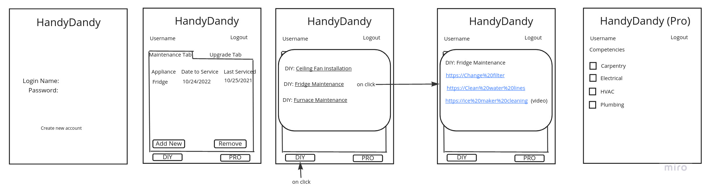

# HandyDandy

HandyDandy is an app for people in need of home maintenance or have desires to upgrade their home, as well as Professionals who want to offer their services. It allows users track and schedule preventative maintenance, as well as any home upgrades that have been wanted, scheduled, or completed. Users will be given the option to choose to DIY, which will provide video and written instructions, or choose to hire a pro in the local area. Pro users will be able to select their competencies, so users can easily find and hire them.

## Wireframes



## [User Stories](https://github.com/Skywalker401/handydandy/issues/2)

## Database Schema Diagram

`User schema`

```python
{
  name: str,
  email: str,
  phone_number: int,
  maintenance: list[object],
  upgrades: list[object],
  area: str,
  property_type: str
}
```

`Pro schema`

```python
{
  name: str,
  email: str,
  phone_number: int,
  competencies: list,
  area: str,
}
```
