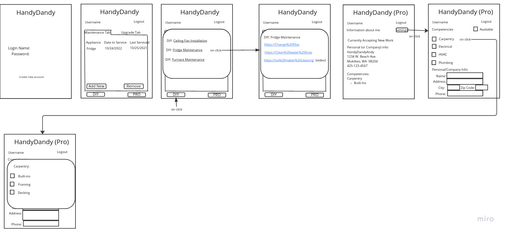

<<<<<<< HEAD
This is a [Next.js](https://nextjs.org/) project bootstrapped with [`create-next-app`](https://github.com/vercel/next.js/tree/canary/packages/create-next-app).

## Getting Started

First, run the development server:

```bash
npm run dev
# or
yarn dev
```

Open [http://localhost:3000](http://localhost:3000) with your browser to see the result.

You can start editing the page by modifying `pages/index.js`. The page auto-updates as you edit the file.

[API routes](https://nextjs.org/docs/api-routes/introduction) can be accessed on [http://localhost:3000/api/hello](http://localhost:3000/api/hello). This endpoint can be edited in `pages/api/hello.js`.

The `pages/api` directory is mapped to `/api/*`. Files in this directory are treated as [API routes](https://nextjs.org/docs/api-routes/introduction) instead of React pages.

## Learn More

To learn more about Next.js, take a look at the following resources:

- [Next.js Documentation](https://nextjs.org/docs) - learn about Next.js features and API.
- [Learn Next.js](https://nextjs.org/learn) - an interactive Next.js tutorial.

You can check out [the Next.js GitHub repository](https://github.com/vercel/next.js/) - your feedback and contributions are welcome!

## Deploy on Vercel

The easiest way to deploy your Next.js app is to use the [Vercel Platform](https://vercel.com/new?utm_medium=default-template&filter=next.js&utm_source=create-next-app&utm_campaign=create-next-app-readme) from the creators of Next.js.

Check out our [Next.js deployment documentation](https://nextjs.org/docs/deployment) for more details.
=======
# HandyDandy

HandyDandy is an app for people in need of home maintenance or have desires to upgrade their home, as well as Professionals who want to offer their services. It allows users track and schedule preventative maintenance, as well as any home upgrades that have been wanted, scheduled, or completed. Users will be given the option to choose to DIY, which will provide video and written instructions, or choose to hire a pro in the local area. Pro users will be able to select their competencies, so users can easily find and hire them.

## Wireframes



## [User Stories](https://github.com/Skywalker401/handydandy/issues/2)

## Domain Model


## Database Schema Diagram

`User schema`

```python
{
  name: str,
  email: str,
  phone_number: int,
  maintenance: list[object],
  upgrades: list[object],
  area: str,
  property_type: str
}
```

`Pro schema`

```python
{
  name: str,
  email: str,
  phone_number: int,
  competencies: list,
  area: str,
}
```
>>>>>>> 15ce264c48b6961756d6917ced88fd0afb2170d6
